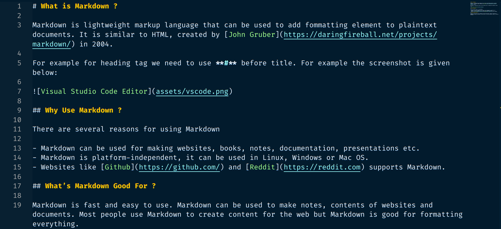

# What is Markdown ?

Markdown is lightweight markup language that can be used to add fommatting element to plaintext documents. It is similar to HTML, created by [John Gruber](https://daringfireball.net/projects/markdown/) in 2004.

For example for heading tag we need to use **#** before title. For example the screenshot is given below:

## Why Use Markdown ?

There are several reasons for using Markdown

- Markdown can be used for making websites, books, notes, documentation, presentations etc.
- Markdown is platform-independent, it can be used in Linux, Windows or Mac OS.
- Websites like [Github](https://github.com/) and [Reddit](https://reddit.com) supports Markdown.

## What’s Markdown Good For ?

Markdown is fast and easy to use. Markdown can be used to make notes, contents of websites and documents. Most people use Markdown to create content for the web but Markdown is good for formatting everything.
